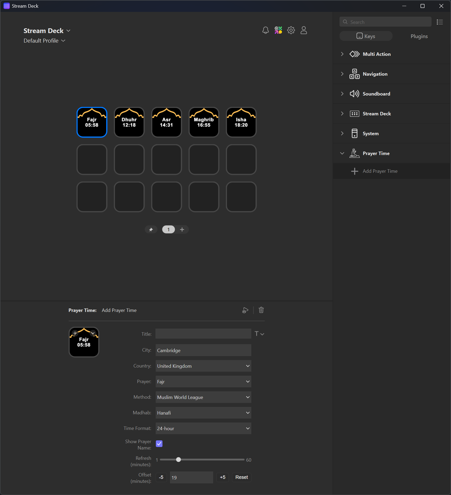

# Stream Prayer Time (Stream Deck Plugin)

This repository contains a Stream Deck plugin that shows a single prayer time (Fajr, Dhuhr, Asr, Maghrib, or Isha) on each key. Each action instance can be configured with its own location and calculation method, and the plugin periodically refreshes the displayed time by geocoding the city/country and calling the Aladhan prayer times API.



## User Quick Start

1) Build the plugin: `npm run build`
2) Open Stream Deck and add the "Prayer Time" action to a key.
3) In the Property Inspector:
   - Set City and select Country.
   - Choose the Prayer and calculation Method/Madhab.
   - (Optional) Set time format, refresh interval, and offset minutes.
4) If the key shows "Err", re-check City/Country and your network connection.

## What Changed (from the starter repo)

- Replaced the starter "increment counter" action with a prayer-time action.
- Added a prayer-time Property Inspector UI for settings.
- Updated the plugin manifest to point at the new action UUID and UI.
- Added geocoding + API fetching, caching, and timed refresh logic in the action implementation.
- Added a country dropdown (full list) and an offset control with quick +/- buttons.

Key changes are located in:
- `src/plugin.ts` (registers the new action)
- `src/actions/prayer-time.ts` (core logic)
- `com.bilalelhoudaigui.stream-prayer-time.sdPlugin/manifest.json` (manifest updates)
- `com.bilalelhoudaigui.stream-prayer-time.sdPlugin/ui/prayer-time.html` (settings UI)

## How the Plugin Works

```
Stream Deck
  |
  | 1) willAppear / didReceiveSettings
  v
PrayerTimeAction (Singleton)
  |
  | normalize settings + start timer
  v
getTimings()
  |       \
  | cache  \ if cache miss or stale
  v         v
cache hit   geocode() -> Nominatim
  |                 |
  |            fetchTimings() -> Aladhan API
  |                 |
  \-----------------/
          |
          v
    formatTime()
          |
          v
     setTitle()
```

### Runtime Flow

1) Stream Deck loads the plugin and the action appears on a key.
2) The plugin normalizes settings (fills defaults if empty).
3) The plugin starts a refresh timer for that key.
4) The plugin geocodes the location, fetches prayer times (with caching), and sets the key title.
5) A key press triggers a manual refresh (and clears the cache).

### Action Lifecycle

The action is implemented as a `SingletonAction`, so one class instance manages all action instances (keys).

- `onWillAppear`
  - Normalizes settings and persists defaults.
  - Starts a refresh timer for that key.
  - Immediately updates the key title.

- `onDidReceiveSettings`
  - Called whenever the Property Inspector changes settings.
  - Resets the timer and refreshes the title.

- `onWillDisappear`
  - Clears the refresh timer for that key.

- `onKeyDown`
  - Clears the cache for the current location.
  - Triggers a manual refresh.

### Title Rendering

The key title is set to either:

- `Prayer\nTime` (two lines), or
- `Time` (if "Show Prayer Name" is disabled)

The time is formatted in 24h or 12h format, optional offset minutes are applied, and the value is extracted from the API response string (handles suffixes like timezones).

## API Usage

The plugin calls the following endpoints:

Geocoding (city + country -> lat/long):

`https://nominatim.openstreetmap.org/search`

Prayer timings (lat/long -> timings):

`https://api.aladhan.com/v1/timings`

Parameters used:
- Geocode: `city`, `country`, `format=json`, `limit=1`
- Timings: `latitude`, `longitude`, `method` (calculation method), `school` (madhab)

The API response is validated and the `timings` object is used to display the chosen prayer.

## Caching & Refreshing

To avoid repeated API calls:

- Geocode results are cached per `(city, country)` combination (24h).
- Timings are cached per `(lat, long, method, madhab)` combination.
- The cache is valid for `refreshMinutes`.
- Cache entries are also invalidated when the local date changes.

Each action instance has its own timer:

- The timer interval is set by `refreshMinutes`.
- Timers are stored by action id and cleared on `onWillDisappear`.

## Settings (Property Inspector)

Settings are stored per key. Available fields:

- `city` (string)
- `country` (string)
- `prayer` (Fajr, Dhuhr, Asr, Maghrib, Isha)
- `method` (calculation method ID)
- `madhab` (0 = Shafi, 1 = Hanafi)
- `timeFormat` ("24h" or "12h")
- `showPrayerName` (boolean)
- `refreshMinutes` (number)
- `offsetMinutes` (number, -30..+30)

Default settings are defined in `src/actions/prayer-time.ts`.

### SDPI Value Parsing

SDPI controls often return string values. The plugin uses a defensive `toNumber(...)` helper to parse numeric settings for `method`, `madhab`, `refreshMinutes`, and `offsetMinutes`.

## File Structure (Relevant)

- `src/plugin.ts`  
  Registers the action with the Stream Deck SDK.

- `src/actions/prayer-time.ts`  
  Action implementation: API calls, caching, refresh timers, settings normalization, and title formatting.

- `com.bilalelhoudaigui.stream-prayer-time.sdPlugin/manifest.json`  
  Declares the action UUID, name, icons, and Property Inspector.

- `com.bilalelhoudaigui.stream-prayer-time.sdPlugin/ui/prayer-time.html`  
  Property Inspector controls for configuration.

- `com.bilalelhoudaigui.stream-prayer-time.sdPlugin/ui/countries.js`  
  Full country list for the dropdown.

- `com.bilalelhoudaigui.stream-prayer-time.sdPlugin/ui/offset-controls.js`  
  Offset buttons and reset behavior for the Property Inspector.

## Build & Run

Build the plugin:

```powershell
npm run build
```

During development, you can run:

```powershell
npm run watch
```

This watches source files and restarts the Stream Deck plugin after each build.

## Notes / Troubleshooting

- If you previously placed the old counter action on a key, remove it and add the new "Prayer Time" action; the UUID changed.
- If the title shows "Err", check:
  - Your network connection
  - City/country spelling (geocode failures will surface as errors)
  - Stream Deck logs in `com.bilalelhoudaigui.stream-prayer-time.sdPlugin/logs`
- If you see 429 (Too Many Requests), increase the refresh interval or reduce the number of keys using the action.

## Images/Icons Attribution

* <a href="https://www.flaticon.com/free-icons/prayer" title="prayer icons">Prayer icons created by iconnut - Flaticon</a>
* <a href="https://www.flaticon.com/free-icons/mosque" title="mosque icons">Mosque icons created by MEDZ - Flaticon</a>
* <a href="https://www.needpix.com/photo/1163576/" title="islamic background">Mosque Islam Night Free Photo by StudioLabs - needpix.com</a>
